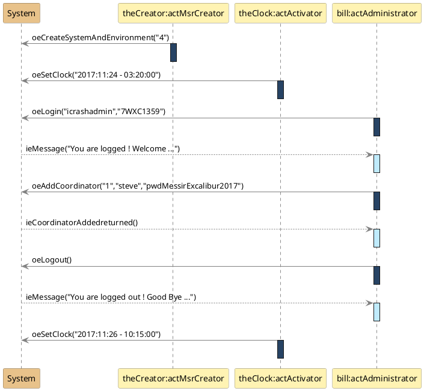

<RULES-LUCIM-DIAGRAM>

# LUCIM Diagram Rules (strict)

## Element Rules
- `Interaction`: Root container for the LUCIM model
- `Lifeline`: System and Actor participants
- `Message`: Actor↔System communications only
- `OccurrenceSpecification`: Message send/receive events
- `ExecutionSpecification`: Actor activation intervals

## Forbidden UML Concepts
- `CombinedFragment`: No combined fragments
- `InteractionOperand`: No interaction operands
- `Constraint`: No constraint
- `InteractionUse`: No interaction references
- `StateInvariant`: No state constraints
- `Gate`: No interface gates
- `GeneralOrdering`: Temporal order is textual order
- `DestructionOccurrenceSpecification`: No object destruction
- `CreationEvent`: No object creation during interaction

## Mapping to UML Metamodel
The following mapping is used to map the LUCIM DSL abstract syntax concepts to the UML metamodel abstract syntax concepts in the format  LUCIM-CONCEPTS → UML-CONCEPTS.
- LUCIM Scenario (SCE) → UML Interaction: exactly one per model, root container
- LUCIM System (SYS) → UML Lifeline: exactly one, named "System"
- LUCIM Actor (ACT) → UML Lifeline: not "System"; type matches `Act[A-Z][A-Za-z0-9]*`
- LUCIM Output Event (OE) → UML Message: sender Actor, receiver System
- LUCIM Input Event (IE) → UML Message: sender System, receiver Actor
- LUCIM Activation Bar (AB) → UML ExecutionSpecification: only on Actors; no nesting/overlap; none on System
- LUCIM Event Parameter (EP) → UML ValueSpecification(s): ordered arguments on Messages


## Valid PlantUML format

<LDR0-PLANTUML-BLOCK-ONLY>
The PlantUML Diagram <PLANTUML-DIAGRAM> must be a solely plantuml block. <PLANTUML-DIAGRAM> must not include Markdown code fences or any text outside the plantuml object. Solution is to remove the markdown code fences and any text outside the plantuml object.
</LDR0-PLANTUML-BLOCK-ONLY>


## Quantitative Rules

<LDR1-SYS-UNIQUE>
There must be exactly one System lifeline per diagram.
</LDR1-SYS-UNIQUE>


### Message Flow Rules

<LDR2-ACTOR-DECLARED-AFTER-SYSTEM>
The actors must be declared after the System.
</LDR2-ACTOR-DECLARED-AFTER-SYSTEM>

<LDR3-SYSTEM-DECLARED-FIRST>
The System must be declared first before all actors.
</LDR3-SYSTEM-DECLARED-FIRST>

<LDR4-EVENT-DIRECTIONALITY>
Every message in a LUCIM interaction must connect exactly one Actor lifeline and the System lifeline.
</LDR4-EVENT-DIRECTIONALITY>

<LDR5-SYSTEM-NO-SELF-LOOP>
Events must never be from System to System. System → System
</LDR5-SYSTEM-NO-SELF-LOOP>

<LDR6-ACTOR-NO-ACTOR-LOOP>
Events must never be from Actor to Actor. Actor → Actor
</LDR6-ACTOR-NO-ACTOR-LOOP>

<LDR7-ACTIVATION-BAR-SEQUENCE>
For each event, an activation must be used, it must occur on the Actor lifeline immediately after the event occurrence. No activations must occur on the System lifeline. The activation must start right after the event and must end before any subsequent event that depends on its completion.
</LDR7-ACTIVATION-BAR-SEQUENCE>

<LDR8-ACTIVATION-BAR-NESTING-FORBIDDEN>
Activation bars must never be nested. 
</LDR8-ACTIVATION-BAR-NESTING-FORBIDDEN>

<LDR9-ACTIVATION-BAR-OVERLAPPING-FORBIDDEN>
Activation bars must never overlap. Following sequence is forbidden: an event, start of activation bar of this event, another event before the end of the activation bar.
</LDR9-ACTIVATION-BAR-OVERLAPPING-FORBIDDEN>

<LDR10-ACTIVATION-BAR-ON-SYSTEM-FORBIDDEN>
There must be NO activation bar in the System lifeline. Never activate System.
</LDR10-ACTIVATION-BAR-ON-SYSTEM-FORBIDDEN>

### Graphical Syntactic Rules

<LDR11-SYSTEM-SHAPE>
System must be declared as a PlantUML participant, with a rectangle shape.
</LDR11-SYSTEM-SHAPE>

<LDR12-SYSTEM-COLOR>
The System rectangle background must be #E8C28A
</LDR12-SYSTEM-COLOR>

<LDR13-ACTOR-SHAPE>
Each actor is declared as a PlantUML participant with a rectangle-shape.
</LDR13-ACTOR-SHAPE>

<LDR14-ACTOR-COLOR>
The actors rectangle background must be #FFF3B3
</LDR14-ACTOR-COLOR>

<LDR15-ACTIVATION-BAR-INPUT-EVENT-COLOR>
The background of an activation bar placed just after an input event must be #C0EBFD
</LDR15-ACTIVATION-BAR-INPUT-EVENT-COLOR>

<LDR16-ACTIVATION-BAR-OUTPUT-EVENT-COLOR>
The background of an activation bar placed just after an output event must be #274364
</LDR16-ACTIVATION-BAR-OUTPUT-EVENT-COLOR>

### Textual Syntactic Rules

<LDR17-ACTOR-DECLARATION-SYNTAX>
Each actor must be declared using this PlantUML syntax:
participant "actorInstanceName:ActActorType" as actorInstanceName
Example 1: participant "theCreator:ActMsrCreator" as theCreator
Example 2: participant "chris:ActEcologist" as chris
where ActActorType must be a valid actor type as defined in the <LUCIM-SCENARIO>,
and actorInstanceName must be a valid actor instance name as defined in the <LUCIM-SCENARIO>.
</LDR17-ACTOR-DECLARATION-SYNTAX>


<LDR18-DIAGRAM-LUCIM-REPRESENTATION>
A LUCIM use case instance must be represented as a UML Sequence Diagram using strictly PlantUML textual syntax.
</LDR18-DIAGRAM-LUCIM-REPRESENTATION>

<LDR19-DIAGRAM-ALLOW-BLANK-LINES-AND-COMMENTS>
In PlantUML diagrams, blank lines and comments are allowed and must be ignored.
</LDR19-DIAGRAM-ALLOW-BLANK-LINES-AND-COMMENTS>

<LDR20-ACTIVATION-BAR-SEQUENCE>
Strictly follow this sequence of instructions for activation bars declarations:
(1) an event declaration
(2) activate the participant related to the event
(3) deactive the participant related to the event
Procedural guidance for PlantUML; the normative ordering is defined by <SS2-AB-PLACEMENT-ORDERING>.
</LDR20-ACTIVATION-BAR-SEQUENCE>

<LDR21-EVENT-PARAMETER-TYPE>
Event parameters format may be of any type.
</LDR21-EVENT-PARAMETER-TYPE>

<LDR22-EVENT-PARAMETER-FLEX-QUOTING>
Each event parameter may be surrounded by single-quote (') OR double-quote (") OR no quote at all. A mix of single-quote, double-quote, no quote IS allowed within a parameter list.
</LDR22-EVENT-PARAMETER-FLEX-QUOTING>

<LDR23-EVENT-PARAMETER-COMMA-SEPARATED>
Multiple parameters must be comma-separated.
</LDR23-EVENT-PARAMETER-COMMA-SEPARATED>

<LDR24-SYSTEM-DECLARATION>
Declare the System participant using the syntax: participant System as system
</LDR24-SYSTEM-DECLARATION>

<LDR25-INPUT-EVENT-SYNTAX>
All ie event names are prefixed with "ie".
ie event names may be generic.
ie events must be modeled using dashed arrows and following this declaration syntax:
system --> theParticipant : ieMessageName(EP)
Example 1 : system --> jen : ieValidationFromTownHall()
Example 2 : system --> jen : ieMessage("Congratulations jen for your 6-years mandate as a major of the town !")
</LDR25-INPUT-EVENT-SYNTAX>

<LDR26-OUTPUT-EVENT-SYNTAX>
All oe event names are prefixed with "oe"
oe event names may be generic.
oe events must be modeled using continuous arrows and following this declaration syntax:
the participant -> system : oeMessage(EP)
Example: alex -> system : oeConstructionRequest("hpc")
</LDR26-OUTPUT-EVENT-SYNTAX>


## Naming Conventions Rules


<LDR27-ACTOR-INSTANCE-FORMAT>
All actor instance names must be human-readable in camelCase.
Example: actAdministrator, chris, theClock, anEcologist.
</LDR27-ACTOR-INSTANCE-FORMAT>

<LDR28-ACTOR-INSTANCE-NAME-CONSISTENCY>
All actor instance names must be consistent with the actor type names defined in <LUCIM-SCENARIO>.
Example: actAdministrator for an ActAdministrator type, chris for an ActEcologist type, joe for an ActUser type, theClock for an ActClock type, anEcologist for an ActEcologist type.
</LDR28-ACTOR-INSTANCE-NAME-CONSISTENCY>


### Informative Examples and Counter-examples

#### Valid LUCIM PlantUML diagram


#### Common Violations

Violation LDR2-ACTOR-DECLARED-AFTER-SYSTEM (Actor→Actor):
```plantuml
actUser -> actAdmin : oeDirectMessage("hello")  // FORBIDDEN
```

Violation LDR5-SYSTEM-NO-SELF-LOOP (System self-loop):
```plantuml
system -> system : ieInternalProcess()  // FORBIDDEN
```

Violation LDR10-ACTIVATION-BAR-ON-SYSTEM-FORBIDDEN (System activation):
```plantuml
activate system  // FORBIDDEN
```

Violation LDR25-INPUT-EVENT-SYNTAX (System→Actor continuous arrows message):
```plantuml
system -> actUser : ieWelcomeMessage("Hello John!") // FORBIDDEN
```

Violation LDR26-OUTPUT-EVENT-SYNTAX (Actor→System dashed arrows message):
```plantuml
actUser --> system : oeWelcomeMessage("Hello John!") // FORBIDDEN
```

Violation LDR20-ACTIVATION-BAR-SEQUENCE (invalid activation bar sequence):
```plantuml
activate actUser 
actUser -> system : oeWelcomeMessage("Hello John!") //FORBIDDEN
deactivate actUser
```

## 6. Compliance Rules Summary

All rules are normative. Rules start with a placeholder <RULE-ID> and are followed by a description and closed by a placeholder </RULE-ID>. e.g. LDR1-SYSTEM-UNIQUE is a rule identifier and the text contained between <LDR1-SYSTEM-UNIQUE> and </LDR1-SYSTEM-UNIQUE> is the rule description.

</RULES-LUCIM-DIAGRAM>
