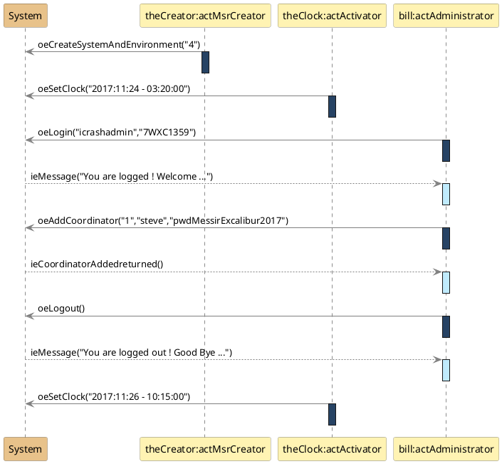

<RULES-LUCIM-DIAGRAM>

# LUCIM Diagram Rules (strict)

## Element Rules
- `Interaction`: Root container for the LUCIM model
- `Lifeline`: System and Actor participants
- `Message`: Actor↔System communications only
- `OccurrenceSpecification`: Message send/receive events
- `ExecutionSpecification`: Actor activation intervals

## Forbidden UML Concepts
- `CombinedFragment`: No combined fragments
- `InteractionOperand`: No interaction operands
- `Constraint`: No constraint
- `InteractionUse`: No interaction references
- `StateInvariant`: No state constraints
- `Gate`: No interface gates
- `GeneralOrdering`: Temporal order is textual order
- `DestructionOccurrenceSpecification`: No object destruction
- `CreationEvent`: No object creation during interaction

## Mapping to UML Metamodel
The following mapping is used to map the LUCIM DSL abstract syntax concepts to the UML metamodel abstract syntax concepts in the format  LUCIM-CONCEPTS → UML-CONCEPTS.
- LUCIM Scenario (SCE) → UML Interaction: exactly one per model, root container
- LUCIM System (SYS) → UML Lifeline: exactly one, named "System"
- LUCIM Actor (ACT) → UML Lifeline: not "System"; type matches `Act[A-Z][A-Za-z0-9]*`
- LUCIM Output Event (OE) → UML Message: sender Actor, receiver System
- LUCIM Input Event (IE) → UML Message: sender System, receiver Actor
- LUCIM Activation Bar (AB) → UML ExecutionSpecification: only on Actors; no nesting/overlap; none on System
- LUCIM Event Parameter (EP) → UML ValueSpecification(s): ordered arguments on Messages


## Valid JSON format

<LDR0-JSON-BLOCK-ONLY>
The PlantUML Diagram <PLANTUML-DIAGRAM> must be a solely a JSON block. <PLANTUML-DIAGRAM> must not include Markdown code fences or any text outside the JSON object.
</LDR0-JSON-BLOCK-ONLY>


## Quantitative Rules

<LDR1-SYS-UNIQUE>
There must be exactly one System per model that is always named System
</LDR1-SYS-UNIQUE>

<LDR2-SYS-UNIQUE-IDENTITY>
There SHALL be exactly one logical System lifeline in the interaction, and its canonical rendered name SHALL be "System".
</LDR2-SYS-UNIQUE-IDENTITY>

**AS — Actors (ACT)**


<LDR3-ACT-DECLARED-AFTER-SYS>
The actors must be declared after the System.
</LDR3-ACT-DECLARED-AFTER-SYS>

<LDR4-SYS-DECLARED-FIRST>
The System must be declared first before all actors.
</LDR4-SYS-DECLARED-FIRST>


<LDR5-SYS-ACT-ALLOWED-EVENTS>
Events must always be from System (resp. Actor) to an Actor (resp. the System). System → Actor or Actor → System
Canonical semantics for message directionality is specified in <SS1-MESSAGE-DIRECTIONALITY>.
</LDR5-SYS-ACT-ALLOWED-EVENTS>

<LDR6-ACT-DECLARED-AFTER-SYS>
The actors must be declared after the System.
</LDR6-ACT-DECLARED-AFTER-SYS>


<LDR7-SYS-NO-SELF-LOOP>
Events must never be from System to System. System → System
Canonical semantics for message directionality is specified in <SS1-MESSAGE-DIRECTIONALITY>.
</LDR7-SYS-NO-SELF-LOOP>

### Message Flow Rules

**SS — Message Directionality **

<LDR8-MESSAGE-DIRECTIONALITY>
Every message in a LUCIM interaction SHALL connect exactly one Actor lifeline and the unique System lifeline. Messages between two Actors and messages from System to System are FORBIDDEN.
</LDR8-MESSAGE-DIRECTIONALITY>


**Rules Activation Bars (AB)**

<LDR9-AB-NO-NESTING>
Activator bars must never be nested.
</LDR9-AB-NO-NESTING>

<LDR10-AB-ORDER>
For each event, an activator bar must be defined that is always beginning just after the event.
Activation bars must always be located on the side of the actor lifeline, never on the side of the System.
See <SS2-AB-PLACEMENT-ORDERING> for the normative ordering and placement constraint.
</LDR10-AB-ORDER>

<LDR11-AB-NO-OVERLAPPING>
Activation bars must never overlap. Following sequence is forbidden: an event, start of activation bar of this event, another event before the end of the activation bar.
</LDR11-AB-NO-OVERLAPPING>


<LDR12-AB-PLACEMENT-ORDERING>
For each message, if an activation is used, it SHALL occur on the Actor lifeline immediately after the message occurrence. No activations SHALL occur on the System lifeline. The activation SHALL start right after the message and SHALL end before any subsequent message that depends on its completion.
</LDR12-AB-PLACEMENT-ORDERING>


### 3.2 Graphical Concrete Syntax (GCS)

**GCS — System (SYS)**

<LDR13-SYS-PARTICIPANT-RECTANGLE>
System must be declared as a PlantUML participant, with a rectangle shape.
</LDR13-SYS-PARTICIPANT-RECTANGLE>

<LDR14-SYS-COLOR>
The System rectangle background must be #E8C28A
</LDR14-SYS-COLOR>

**GCS — Actors (ACT)**

<LDR15-ACT-PARTICIPANT-RECTANGLE>
Each actor is modelled as a PlantUML participant with a rectangle-shape.
</LDR15-ACT-PARTICIPANT-RECTANGLE>

<LDR16-ACT-COLOR>
The actors rectangle background must be #FFF3B3
</LDR16-ACT-COLOR>

**GCS — Activation Bars (AB)**

<LDR17-AB-IE-COLOR>
The background of an activation bar placed just after an input event must be #C0EBFD
</LDR17-AB-IE-COLOR>

<LDR18-AB-OE-COLOR>
The background of an activation bar placed just after an output event must be #274364
Note: Activation bars appear only on actor lifelines; see <SS2-AB-PLACEMENT-ORDERING> for normative placement.
</LDR18-AB-OE-COLOR>


<LDR19-ACT-DECLARATION-SYNTAX>
Each actor must be modelled using this PlantUML syntax:
participant "anActorName:ActActorType" as anActorName
Example 1: participant "theCreator:ActMsrCreator" as theCreator
Example 2: participant "chris:ActEcologist" as chris
</LDR19-ACT-DECLARATION-SYNTAX>

### 3.1 Textual Concrete Syntax (TCS)

**TCS — Scenario (SCE)**

<LDR20-SCE-LUCIM-REPRESENTATION>
A LUCIM use case instance must be represented as a UML Sequence Diagram using strictly PlantUML textual syntax.
</LDR20-SCE-LUCIM-REPRESENTATION>

<LDR21-SCE-ALLOW-BLANK-LINES>
In PlantUML diagrams, blank lines may safely be ignored.
</LDR21-SCE-ALLOW-BLANK-LINES>


**TCS — Activation Bars (AB)**

<LDR22-AB-SEQUENCE>
Strictly follow this sequence of instructions for activation bars declarations:
(1) an event declaration
(2) activate the participant related to the event
(3) deactive the participant related to the event
Procedural guidance for PlantUML; the normative ordering is defined by <SS2-AB-PLACEMENT-ORDERING>.
</LDR22-AB-SEQUENCE>

<LDR23-AB-NO-ACTIVATION-BAR-ON-SYSTEM>
There must be NO activation bar in the System lifeline. Never activate System.
Activation bar colors are specified in <GCS5-AB-IE-COLOR> and <GCS6-AB-OE-COLOR>.
</LDR23-AB-NO-ACTIVATION-BAR-ON-SYSTEM>

**TCS — Event Parameters (EP)**


<LDR24-EP-TYPE>
Event parameters format may be of any type.
</LDR24-EP-TYPE>


<LDR25-EP-FLEX-QUOTING>
Each event parameter may be surrounded by single-quote (') OR double-quote (") OR no quote at all. A mix of single-quote, double-quote, no quote IS allowed within a parameter list.
</LDR25-EP-FLEX-QUOTING>


<LDR26-EP-COMMA-SEPARATED>
Multiple parameters must be comma-separated.
</LDR26-EP-COMMA-SEPARATED>

**TCS — System (SYS)**

<LDR27-SYS-DECLARATION>
Declare the System participant first using the syntax: participant System as system.
See <SS3-SYS-UNIQUE-IDENTITY> for uniqueness and canonical naming.
</LDR27-SYS-DECLARATION>


**TCS — Input Events (IE)**

<LDR28-IE-SYNTAX>
All ie event names are prefixed with "ie".
ie event names may be generic.
ie events must be modeled using dashed arrows and following this declaration syntax:
system --> theParticipant : ieMessageName(EP)
Example 1 : system --> jen : ieValidationFromTownHall()
Example 2 : system --> jen : ieMessage("Congratulations jen for your 6-years mandate as a major of the town !")
See <SS1-MESSAGE-DIRECTIONALITY> for the normative message directionality constraint.
</LDR28-IE-SYNTAX>

**TCS — Output Events (OE)**

<LDR29-OE-SYNTAX>
All oe event names are prefixed with "oe"
oe event names may be generic.
oe events must be modeled using continuous arrows and following this declaration syntax:
the participant -> system : oeMessage(EP)
Example: alex -> system : oeConstructionRequest("hpc")
See <SS1-MESSAGE-DIRECTIONALITY> for the normative message directionality constraint.
</LDR29-OE-SYNTAX>


## 4. Informative Examples and Counter-examples

### 4.1  Valid LUCIM PlantUML diagram


### 4.2 Common Violations

Violation LDR3-ACT-DECLARED-AFTER-SYS (Actor→Actor):
```plantuml
actUser -> actAdmin : oeDirectMessage("hello")  // FORBIDDEN
```

Violation LDR7-SYS-NO-SELF-LOOP (System self-loop):
```plantuml
system -> system : ieInternalProcess()  // FORBIDDEN
```

Violation LDR23-AB-NO-ACTIVATION-BAR-ON-SYSTEM (System activation):
```plantuml
activate system  // FORBIDDEN
```

Violation LDR28-IE-SYNTAX (System→Actor continuous arrows message):
```plantuml
system -> actUser : ieWelcomeMessage("Hello John!") // FORBIDDEN
```

Violation LDR29-OE-SYNTAX (Actor→System dashed arrows message):
```plantuml
actUser --> system : oeWelcomeMessage("Hello John!") // FORBIDDEN
```

Violation LDR22-AB-SEQUENCE (invalid activation bar sequence):
```plantuml
activate actUser 
actUser -> system : oeWelcomeMessage("Hello John!") //FORBIDDEN
deactivate actUser
```

## 6. Compliance Rules Summary

All rules are normative. Rules start with a placeholder <RULE-ID> and are followed by a description and closed by a placeholder </RULE-ID>. e.g. LDR1-SYS-UNIQUE is a rule identifier and the text contained between <LDR1-SYS-UNIQUE> and </LDR1-SYS-UNIQUE> is the rule description.

</RULES-LUCIM-DIAGRAM>

